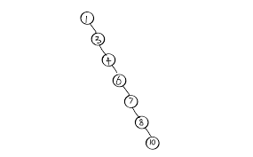
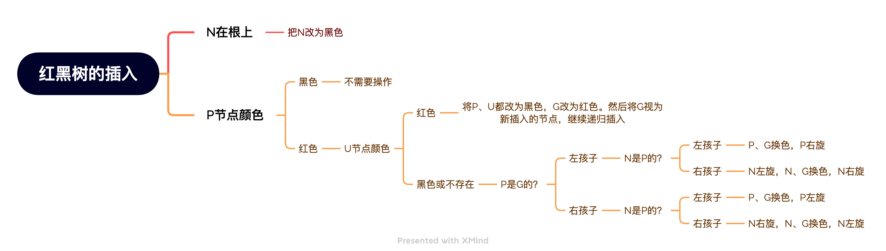

# 红黑树

## 性质

红黑树是没哥节点都带有颜色属性的二叉查找树（也叫做二叉排序树），颜色为红色或者黑色，除了满足二叉查找树的要求外，还需要满足：

1. 节点是红色或者黑色

2. 根是黑色

3. 所有叶子结点都是黑色（叶子节点是NIL节点）

4. 每个红色节点必须要有两个黑色的子节点(父子节点之间不能出现两个连续的红节点)

5. 从任一节点到其每个叶子结点的所有简单路径都必须包含相同数目的黑色节点

如图是一个具体的红黑树

> 分析：
>
> 1. 我们使用空来表示叶子，这样它不包含数据而只是充当在树在此结束的指示。因此所有的节点都有两个子节点。
>
> 2. 根到叶子最短路径问题：
>
>    由于存在性质5（从任一节点到其每个叶子结点的所有简单路径都必须包含相同数目的黑色节点），所以最短路径就是红色节点最少的路径，最理想的情况下没有红色节点，全是黑色节点。
>
> 3. 根到叶子最长路径问题：
>
>    注意到性质4（父子节点之间不能出现两个连续的红节点），结合每条路径黑色节点数相同，因此红色节点最多的路径就是最长路径，理想情况下就是红黑交替的顺序。
>
>    ==因此，从根到叶子的最长路径不会大于最短路径的两倍。==

我们可以看到，RB-Tree大致上是平衡的。作为反例我们可以看下极端情况下的二叉排序树（BST）。

这个二叉排序树已经链表化了，查询速度和链表是一致的,为O(N)。同时，如果对二叉排序树频繁地插入删除，会导致树的倾斜，树的高度直接影响查找效率。

## 操作

每一个红黑树也是一个二叉排序树，因此红黑树的查找和普通二叉树是一样的。但是删除和插入有特别的地方。插入或者删除元素后，恢复红黑树的性质需要少量的颜色变更和不超过三次树旋转。

### 插入

我们首先通过查找排序二叉树的方法找到需要插入的地方增加一个节点，并将它标记为红色。

> 分析：如果将插入的节点标记为黑色，那么再想满足性质5是一件非常困难的事情；但是如果将插入的节点标记为红色，但是设为红色可能会导致两个连续的红色节点，可以通过改变附近节点颜色和旋转来满足红黑树的性质。

在恢复红黑树的性质之前，我们需要了解以下：

- 我们插入的节点总是默认为红色

- 性质1和性质3总是保持（没什么好说的，很显然）

- 性质4只在增加红色节点、重绘黑色节点为红色，或者旋转时受到威胁。

- 性质5只在增加黑色节点、重绘红色节点为黑色，或者旋转时受到威胁。

- 下面图片中的1，2，3，4，5不是叶子结点而是子树。

讨论插入节点的不同情况：

1. 新节点位于树的根上

   ==这时我们把它重绘为黑色。==

   把根节点重绘为黑色等于给所有路径的距离加一，符合性质5。

2. 新节点的父节点是黑色

   我们插入的节点是红色，同时满足性质4，不会对红黑树的性质有影响。

   ==因此不需要改变。==

   > 接下来的情况父节点都是红色，所以它有祖父结点而且祖父结点G必为黑色。（因为红色节点必定不是根节点，必定会有父节点）

3. 如果父节点P和叔父节点U都是红色。

   此时我们不必区分插入的节点是P节点的左孩子还是右孩子。

   假设祖父节点为G。

   ==我们把父节点P叔父节点U重绘成黑色，然后把祖父节点G重绘为红色。==此时G节点可能影响红黑树的性质，我们需要在祖父节点G上递归地进行从1开始的整个过程（把G当成新加入的节点进行各种情况的检查）

   

   > 在情况4和情况5中，我们假设父节点P是其祖父结点G的左孩子，如果P是G的右孩子则需要反转左右

4. 父节点P是红色而叔父节点U是黑色或者缺少，并且新节点N是其父节点P的右孩子，而父节点P是祖父节点的左孩子。

   ==此时我们对P节点进行一次左旋转来调整新节点N和其父节点；接着我们按情况5来处理以前的父节点P以解决失效的性质4==（出现两个相同的红色节点）。这个改变不会影响性质5（1，2，3，4，5代表子树而不是节点）。

   

   一次完整的过程如下：

5. 父节点P是红色而叔父节点U是黑色或者缺少，新节点N是其父节点P的左孩子，而父节点P是祖父节点G的左孩子。

   ==此时我对G结点进行一次右旋转，旋转后，P变成N和G的父节点，同时切换P和G的颜色（这一步也可以在旋转前）。==

   满足性质4和性质5。

   

如果P是G的右孩子，在情况4和情况5时应该怎么办呢？

1,2,3,4,5是子树而不是节点。

总结：

### 删除

## 参考文档

1. [维基百科：红黑树](https://zh.wikipedia.org/wiki/%E7%BA%A2%E9%BB%91%E6%A0%91)

2. [美团技术博客：红黑树深入剖析及Java实现](https://zhuanlan.zhihu.com/p/24367771)