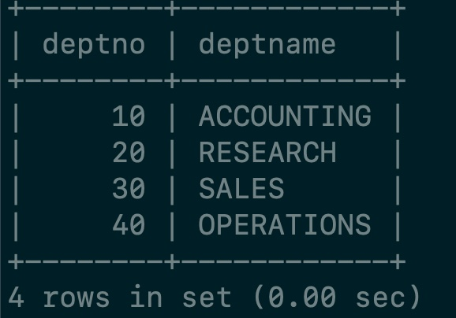
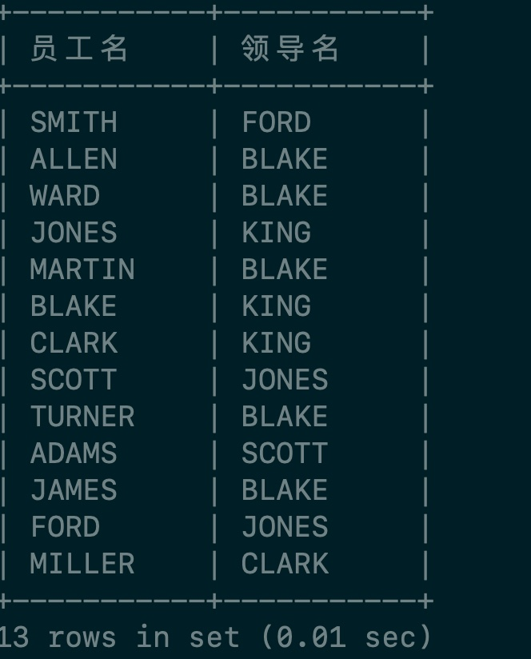
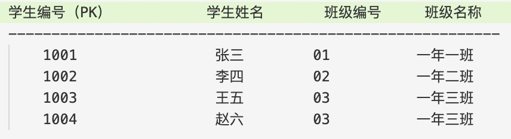

# MySQL

## 1. 数据库概述

### 1.1 数据库、数据库管理系统和SQL

#### **数据库：**

- DataBase 简称DB。按照一定格式存储一些文件的组合

- 存储数据的仓库，也就是一堆文件，这些文件中存储了具有特定格式的数据

#### **数据库管理系统：**

- DataBase Management System，简称DBMS

- 数据库管理系统是专门用来管理数据库中的数据的，数据库管理系统可以对数据库中的数据进行CRUD

- 常见的数据库管理系统有：

  * MySQL

  * Oracle

  * MS SqlServer

  * DB2

  * sybase等

#### **SQL:**

- 结构话查询语言

- 通过编写SQL语句，然后DBMS负责执行SQL语句，最终来完成数据库中的CRUD

- SQL是一套标准，学习SQL语句，可以在MySQL中使用，Oracle中使用等等

#### **三者之间的关系：**

- DBMS-->执行-->SQL-->操作-->DB

先安装数据库管理系统MySQL，然后学习SQL语句怎么写，编写SQL语句之后，DBMS

对SQL语句进行执行，最终来完成数据库的数据管理。

#### **端口号：**

- 端口号port是任何一个软件/应用都有的，是应用的唯一代表

- 端口号通常和IP地址在一块，IP地址用来定位计算机，端口号port用来定位计算机上某个服务/某个应用的

- 在同一台计算机上，端口号不能重复，具有唯一性

- MySQL默认端口号3306

- 安装是记得复制临时密码

#### **字符编码方式：**

- 设置MySQL数据库的字符编码方式为UTF8

MySQL在/usr/local/mysql/下

#### **MySQL的完美卸载**

```shell
brew remove mysql
brew cleanup
sudo rm /usr/local/mysql
sudo rm -rf /usr/local/var/mysql
sudo rm -rf /usr/local/mysql*
sudo rm ~/Library/LaunchAgents/homebrew.mxcl.mysql.plist
sudo rm -rf /Library/StartupItems/MySQLCOM
sudo rm -rf /Library/PreferencePanes/My*
launchctl unload -w~/Library/LaunchAgents/homebrew.mxcl.mysql.plist
edit /etc/hostconfig and remove the line MYSQLCOM=-YES-
rm -rf ~/Library/PreferencePanes/My*
sudo rm -rf /Library/Receipts/mysql*
sudo rm -rf /Library/Receipts/MySQL*
sudo rm -rf /private/var/db/receipts/*mysql*
```

#### **MySQL常用命令**

- 在设置中启动和停止

- mysql -u root -p在终端中登陆(需要将/usr/local/mysql/bin添加到PATH）

- 退出 exit

- 查看有哪些数据库 show databases;

- 选择使用test数据库 use test;

- 创建hyf123数据库 create database hyf123;

- 查看当前数据库有哪些表 show tables;

- 查看MySQL的版本号 select version();

- 查看当前使用的数据库 select database();

- 不见分号不执行，如果想结束 输入‘\\c’终止一条命令的输入

- 命令不区分大小写

- explain + select 语句：查看是否使用了索引

### 1.2 表（table）

表是数据库中最基本的单元

数据库中以表格的形式表示数据的。

任何一张表都有行和列：

- 行（row）：被称为数据/记录

- 列（column）：被称为字段，每一个字段都有：字段名、数据类型、约束等属性

### 1.3 SQL语句的分类

- DQL：数据查询语言（凡事带有select关键字的都是查询语句）

- DML：数据操作语言（凡事表中数据进行增删改的都是DML）

  * insert,update,delete

  * 主要操作表中的数据

- DDL：数据定义语言（凡事带有create、drop、alter的都是DDL）

  * create:新建,等价于增

  * alter：修改

  * drop：删除

  * 与DML不同，主要对表结构进行操作

- TCL：

  * 是事务控制语言

  * 包括

    * 事务提交：commit

    * 事务回滚：rollback

- DCL：

  * 是数据控制语言

  * 例如

    * 授权：grant

    * 撤销权限：revoke

### 1.4 导入演示数据

```shell
 source /Users/heyufan1/Library/Mobile Documents/com~apple~CloudDocs/学习/Blogs/Database/document/bjpowernode.sql
```

show tables

\+------------------+

| Tables_in_hyf123 |

\+------------------+

| DEPT             |

| EMP              |

| SALGRADE         |

\+------------------+

dept是部门表

emp是员工表

salgrade是工资等级表

**查看表中的数据**

```sql
select * from 表名;
```

mysql> select \* from emp;


select \* from dept;


select \* from salgrade;


薪资水平：最低和最高

### 1.5 查看表的结构

```sql
desc 表名;
```

desc emp;

descript描述的缩写


## 2. 简单查询

### 2.1 查询一个字段

```sql
select 字段名 from 表名;
```

- select和from是关键字

- 字段名和表名是标识符

强调：

- 对SQL语句来说，是通用的

- 所有的SQL语句以";"结尾

- 所有的SQL语句不区分大小写

### 2.2 查询两个字段或者多个字段

使用";"隔开

查询部门编号和部门名

```sql
select deptno,dname from dept;
```

### 2.3 查询所有字段

1. 把所有字段写上

2. 使用通配符

   ```sql
   select * from dept;
   ```

   缺点：

   1. 效率低（把所有的\*转化成字段）

   2. 可读性差

   在实际开发中不建议使用

### 2.4 给查询的列起别名

使用as关键字，例如

```sql
select deptno,dname as deptname from dept;
```



> 注意：只是将显示的查询结果列名显示为deptname，原表列名仍然为dname。
>
> 记住：select语句永远不会进行修改操作

以及：as关键字可以省略

```sql
select deptno,dname deptname from dept;
```

==假设起别名中有空格或者中文,可以用单引号(或双引号)包起来==

```sql
select deptno,dname 'dept name' from dept;
select deptno,dname '部门名' from dept;
```

> 注意：
>
> ==在所有的数据库中，字符串统一用单引号括起来==
>
> 单引号是标准，双引号在oracle数据库中用不了

### 2.5 计算员工的年薪

sal \* 12

字段可以用数学表达式

```sql
select ename,sal * 12 as yearsal from emp; //顺便起别名
```

## 3.  条件查询

### 3.1 什么是条件查询

不是将表中所有数据都查出来，是查出来符合条件的

语法：

```sql
select
    字段1,字段2,...
from 
    表名
where 
    条件
```

### 3.2 等号, 小于,大于操作符

= 等于 < 小于 > 大于

包括 <=小于等于 和 >= 大于等于

查询薪资条件等于800的员工的姓名和编号

```sql
select empno,ename from emp where sal = 800;
```

> 如果有字符串记得用单引号括起来

### 3.3 != 或<> 操作符

不等于

查询薪资不等于800的员工姓名和编号

```sql
select empno,ename from emp where sal != 800;

select empno,ename from emp where sal <> 800;
```

### 3.4 between ... and ... 操作符（等价于>= and <=)

查询薪资在2450 和 3000之间的员工信息（包括首尾）

```sql
select empno,ename,sal from emp where sal >= 2450 and sal <= 3000;
```

或者

```sql
select 
    empno,ename,sal 
from 
    emp 
where
    sal between 2450 and 3000;
```


> ==注意：==
>
> 使用between  ... and ... 的时候必须左小右大
>
> between and是闭区间，包括两端的值

### 3.5 is null

查询哪些员工的津贴/补助为null

```sql
select empno,ename,sal,comm from emp where comm is null;
```


> ==注意==
>
> 在数据库中，null不能使用等号进行衡量，需要使用is null
>
> 因为在数据库中null代表什么也没有，不是一个值
>
> 0和null是两回事

查询哪些员工的补助不为null

```sql
select empno,ename,sal,comm from emp where comm is not null;
```


### 3.6 and、or操作符

查询工作岗位是manager并且工资大于2500的员工信息

```sql
select empno,ename,job,sal from emp where job = 'manager' and sal > 2500;
```


查询工作岗位是manager或者salesman的员工

```sql
select empno,ename,job from emp where job = 'manager' or job = 'salesman';
```

> and 和or 同时出现，是否有优先级的问题？
>
> 查询工资大于2500，并且部门编号为10或着20部门的员工
>
> ```sql
> select 
>     * 
> from
>     emp
> where 
>     sal > 2500 and deptno = 10 or deptno = 20;
> ```
>
> 上述语句会先执行and然后执行or,我们需要加括号
>
> ```sql
> select 
>     * 
> from
>     emp
> where 
>     sal > 2500 and (deptno = 10 or deptno = 20);
> ```
>
> and 和or 同时出现，and的优先级更高
>
> 在开发中如果不确定优先级，加小括号

### 3.7 in和not in

in 包含，相当于多个or

not in 则是不再在这个范围

查找工作岗位是manager和salesman的员工

```sql
select empno,ename,job from emp where job = 'manager' or job = 'salesman';
```

用in改写

```sql
select empno,ename,job from emp where job in ('manager','salesman);
```

> 注意
>
> in不是一个区间，in后面跟的是具体的值
>
> 查询薪资是800和5000员工
>
> ```sql
> select ename,sal from emp where sal in (800,5000);
> ```
>
> 而非800到5000的员工

not 就是取反

### 3.8 like 模糊查询

支持%或下划线匹配

%匹配任意多个字符

下滑线：任意一个字符

查询名字中含有o的

```sql
select ename from emp where ename like '%o%';
```

找出名字以T结尾的

```sql
select ename from emp where ename like '%T';
```

找出名字以K开头的

```sql
select ename from emp where ename like 'K%';
```

找出第二个字母是A的

```sql
select ename from emp where ename like '_A%';
```

> 找出名字中有下划线的
>
> 由于下滑线有特殊含义，我们要加‘\\’转义

## 4. 排序

### 4.1 查询所有员工薪资并排序

```sql
select 
    ename,sal 
from 
    emp 
order by 
    sal;
```

默认是升序


指定降序

```sql
select 
    ename,sal 
from 
    emp 
order by 
    sal desc;
```

指定升序

```sql
select 
    ename,sal 
from 
    emp 
order by 
    sal asc;
```

### 4.2 多个字段排序

查询员工名字和薪资，要求按照薪资升序，如果薪资一样，则按照名字升序排序

```sql
select 
    ename,sal
from 
    emp 
order by    
    sal asc, ename asc; //sal在前，起主导作用，只有sal相等的时候才启用ename
```


### 4.3 根据字段位置也能排序

按照查询结果的第二列来排

```sql
select ename,sal from emp order by 2;
```

不建议在开发中这样写，不健壮

因为列的顺序很容易发生改变

### 4.3 综合案例

找出工资在1250到3000之间的员工信息，要求按照薪资降序排列

```sql
select 
    ename,sal
from 
    emp 
where 
    sal between 1250 and 3000
order by 
    sal desc;
```

> 关键字的顺序不能变

执行顺序：

1. from

2. where

3. select

4. order by (排序总是在最后执行)

## 5. 数据处理函数/单行处理函数

单行处理函数的特点：一个输入对应一个输出

与单行处理函数相对的是：多行处理函数(多行处理函数的特点是多个输入对应一个输出)

### 5.1 lower 转小写 upper 转大写

将员工名转换为小写

```sql
select lower(ename) from emp;
```

> 14个输入 14个输出

### 5.2 substr 取子串

substr(被截取的字符串, 起始下标, 截取长度)

> 注意下标从1开始

截取员工姓名的第一个字母

```sql
select substr(ename,1,1) as ename from emp;
```

找出员工名字第一个字母为A的员工信息

```sql
select ename from emp where substr(ename,1,1) = 'A';
```


> 首字母小写
>
> ```sql
> select concat(lower(substr(ename,1,1)),substr(ename,2,length(ename)-1)) as result from emp;
> ```


### 5.3 trim 去空格

```sql
select * from emp where ename = ' KING';
```

显示为空

```sql
select * from emp where ename = trim(' KING');
```

显示出KING的信息

### 5.4 round 四舍五入

假如我们select一个'abc'（一个数据）

```sql
select 'abc' from emp;
```


会产生14个abc而且别名也是abc

select 数字同理

> 结论
>
> select 后面可以跟某个表的字段名(可以等同视为变量名)，也可以跟字面值/数据。
>
> ```sql
> select 2100 as num from emp;
> ```

结合round

```sql
select round(1236.567,0) as result from emp;
```

四舍五入1236.567并且保留0位小数

```sql
select round(1236.567,1) as result from emp; //保留1个小数
select round(1236.567,2) as result from emp;//保留2个小数
select round(1236.567,-1) as result from emp;//保留到10位
select round(1236.567,-2) as result from emp;//保留到100位
```

### 5.5 rand 生成随机数

```sql
select rand() from emp; //生成0到1之间的随机数
```


```sql
select round(rand() * 100) from emp; //生成0到100的随机整数
```

### 5.6 ifnull 空处理

ifnull是空处理函数，专门用来处理空的。

在所有数据库中，只要有null参与的数学计算，结果也是null

如工资和补助相加（补助有null）

```sql
select ename,sal + comm as salcomm from emp;
```

加出了null

计算每个员工的年薪(（月薪+补助）\* 12),需要使用ifnull函数

ifnull(数据, 被当作什么值) // 如果数据为null 把数据当作什么值

```sql
select ename, (sal + ifnull(comm,0)) * 12  as yearsal from emp;//如果补助为null视为0
```


### 5.7  case ... when ... then ... when ... else ... end;

当员工的工作岗位是'manager'的时候，工资上调10%，当员工的工作岗位是'salesman'的时候，工资上调50%。(注意：只显示而不修改数据库的值）

```sql
select ename,job,sal as oldsal,
(case job 
when 'MANAGER' then sal * 1.1 
when 'SALESMAN' then sal * 1.5
else sal
end ) as newsal from emp;
```


## 6. 分组函数/多行处理函数

多行处理函数的特点：输入多行，最终输出一行。

> 分组函数必须先分组再使用
>
> 如果没有对数据进行分组，那么整张表默认是一组。

### 6.1 count 计数

计算员工数量总和

```sql
select count(ename) from emp;
```

### 6.2 sum 求和

计算工资和

```sql
select sum(sal) from emp;
```

### 6.3 avg 平均值

计算平均工资

```sql
select avg(sal) from emp;
```

14个工资加起来除以14

### 6.4 max 最大值

找出最高工资

```sql
select max(sal) from emp;
```

### 6.5 min 最小值

找出最低工资

```sql
select min(sal) from emp;
```

### 6.6 注意事项

1. 分组函数自动忽略null，不需要提前对null进行处理

   1. 计数count不会加上null

   2. 计算平均值也不会计算null

2. 分组函数中` count(*)` 和`count(具体字段)` 有什么区别呢

   1. count(具体字段) ：统计该字段下不为null的元素总数

   2. count(\*) ：统计该行全为null的数据，但是这样的数据在表中不存在，==也就是统计所有行记录。==

3. 分组函数不能直接使用在where子句中

   1. 找出比最低工资高的员工信息

      ```sql
      select ename,sal from emp where sal > min(sal);
      ```

      表面上看没问题，但是会报错

      ERROR 1111 (HY000): Invalid use of group function

      错误使用分组函数,因为先分组再执行where

4. 所有的分组函数可以组合起来一起用

   ```sql
   select sum(sal),min(sal),max(sal),avg(sal),count(sal),count(*) from emp;
   ```

## 7. 分组查询（非常重要！）

在实际应用中，需要先进行分组，再对每一组数据进行操作。

例如：

- 计算每个部门的工资和

- 计算每个岗位的平均工资

- 找出每个工作岗位的最高工资

语法：

```sql
select 
    ...
from 
    ...
where
    ...
group by 
    ...
order by
    ...
```

### 7.1 执行顺序

==以上关键字的顺序不能颠倒，执行顺序是：==

1. from

2. where

3. group by

4. select

5. order by

> 为什么分组函数不能在where后面执行
>
> 因为分组函数在使用的时候必须先分组之后才能使用，where执行的时候还没有分组，where后面不能出现分组函数
>
> 而`select sum(sal) from emp;`能执行是因为select在分组之后执行，没写group by默认分组了。

### 7.2 找出每个工作岗位的工资和

找出每个工作岗位的工资和

实现思路：先按照工作岗位分组，然后对工资求和。

```sql
select 
    sum(sal)
from 
    emp
group by
    job;
```


我们先从emp表中按job分组，然后分组函数按照组进行求和

> 如果加上ename
>
> ```sql
> select 
>     ename,job,sum(sal)
> from 
>     emp
> group by
>     job;
> ```
>
> 会报错，因为job分组后只剩下5组数据。
>
> ==重点结论==
>
> ==在一条select语句中，如果有group by语句的话，select后面只能跟：参加分组的字段和分组函数。其他一律不能跟。==

### 7.3 找出每个部门的最高薪资

找出每个部门的最高薪资

先分组再求最大值

```sql
select 
    deptno,max(sal)
from
    emp
group by 
    deptno;
```

### 7.5 找出每个部门不同工作岗位的最高薪资

==技巧：两个字段联合成一个字段看。==

我们将两个字段联合分组(不同部门的不同工作岗位）

```sql
select 
    job,deptno,max(sal) 
from
     emp 
group by 
    deptno,job;
```


### 7.6 使用having对分组进一步过滤

找出每个部门的最高薪资，要求显示最高薪资大于3000

1. 首先按照部门编号分组，求每个部门的最高薪资

   ```sql
   select 
       deptno,max(sal)
   from 
       emp
   group by
       deptno; 
   ```

   

2. 使用having进一步过滤

   ```sql
   select 
       deptno,max(sal)
   from 
       emp
   group by
       deptno
   having 
       max(sal) > 3000;
   ```

   

> 这样的SQL语句执行效率不高,==where和having优先选择where==
>
> ==where先筛选再分组==
>
> ==having先分组再筛选==
>
> 我们可以先筛选大于3000的然后再分组

```sql
select
    deptno,max(sal)
from
    emp
where
    sal > 3000
group by 
    deptno;
```

### 7.7 where完成不了的

找出每个部门平均薪资，要求显示平均薪资高于2500的。

```sql
select
    deptno,avg(sal)
from
    emp
group by
    deptno
having
    avg(sal)>2500;
```


### 7.7 总结

```sql
select 
    ...
from 
    ...
where
    ...
group
    ...
having    
    ...
order by
    ...
```

执行顺序

1. from

2. where

3. group by

4. having

5. select

6. order by

> 从某张表中查询数据，
>
> 先经过where条件筛选出有价值的数据，
>
> 对这些有价值的数据进行分组，
>
> 分组之后可以使用having继续筛选，
>
> select查询出来，
>
> 最后排序输出。

> 综合案例：
>
> 找出每个岗位的平均薪资，要求显示平均薪资大于1500的，除MANAGER岗位之外，要求按照平均薪资的降序排列
>
> ```sql
> select 
>    job,avg(sal) as avgsal
> from 
>     emp
> where
>     job <> 'MANAGER'
> group by
>     job
> having 
>     avg(sal) > 1500
> order by
>     avgsal desc;//先执行select再执行order by 所以这里可以使用别名
> ```


## 8. 连接查询

### 8.0 把查询结果去重

注意：原表数据不会被修改，只是查询结果去重

```sql
select distinct job from emp;
```


> 注意：==distinct只能出现在所有字段的最前方==，代表后面所有字段联合起来去除重复记录。

统计一下工作岗位的数量

```sql
select count(distinct job) from emp;
```

返回5个工作岗位

### 8.1 什么是连接查询

从一张表中单独查询，称为单独查询。

emp表和dept表中联合起来查询数据，从emp表中取员工名字，从dept表中去部门名字。这种跨表查询，多张表联合起来查询数据，被称为连接查询。

### 8.2 连接查询的分类

根据语法的年代分类：

1. SQL92：1992年出现的语法

2. SQL99：1999年出现的语法

主要学习SQL99

根据表连接的方式分类：

1. 内连接

   1. 等值连接

   2. 非等值连接

   3. 自连接

2. 外连接

   1. 左外连接(左连接)

   2. 右外连接（右连接）

3. 全连接

### 8.3 笛卡尔积

案例：查询每个员工所在的部门名称

两张表连接，没有任何限制

```sql
select ename,dname from emp, dept;
```

会生成14 \* 4行数据


> 当两张表连接，没有任何条件限制的时候，最终查询的结果的条数是两张表行数的乘积，被称为笛卡尔积。

### 8.4 避免笛卡尔积

如何避免笛卡尔积现象？

连接时加条件，满足这个条件的记录被筛选出来。

```sql
select 
    ename,dname
from
    emp,dept
where 
    emp.deptno = dept.deptno;
```


> 思考：
>
> 最终查询的结果是14条，但是匹配的次数仍然是56次，并不会减少）
>
> 只不过进行了四选一

我们可以通过表起别名的方法来提升效率（此效率不是减少匹配次数，而是少打点字）。

```sql
select 
    e.ename,d.dname
from
    emp e,dept d
where 
    e.deptno = d.deptno //SQL92语法
```

显示的时候仍然显示ename和dname而不是e.ename 和d.dname

> 通过笛卡尔积现象的出，表的连接次数越多，效率越低

### 8.5 内连接之等值连接

案例：查询每个员工所在的部门名称，显示员工名和部门

emp e 和 dept d表进行连接，条件是：e.deptno = d.deptno

SQL92的语法：

```sql
select 
    e.ename, d.dname
from 
    emp e, dept d
where 
    e.deptno = d.deptno;
```

> SQL92的缺点：结构不清晰，表连接条件和后期进一步筛选的条件都在where后面

SQL99的语法：

```sql
select 
    e.ename, d.dname
from 
    emp e
inner join 
    dept d
on 
    e.deptno = d.deptno;//条件是等量关系
```

> 在99语法中强调的是表连接和后期过滤的条件不清晰
>
> 99语法结构更清晰一些，后期过滤的条件在where后
>
> 默认是inner join，inner可以省略，带着inner可读性更好

### 8.6 内连接之非等值连接

案例：找出每个员工的薪资等级，并要求显示员工名，薪资和薪资等级。

```sql
select 
    e.ename, e.sal, s.grade
from
    emp e
join # inner可以省略
    salgrade s
on 
    e.sal between s.losal and s.hisal; # 条件不是一个等量关系
```


### 8.7 内连接之自连接

案例：查询员工的上级领导，要求显示员工名和上级领导名

技巧：一张表看作两张表

```sql
select 
    a.ename as '员工名' , b.ename as '领导名'
from 
    emp a
join 
    emp b
on 
    a.mgr = b.empno; # 员工的领导编号等于领导的员工编号
```



只有13行，因为King没有上级

> 以上就是内连接中的：自连接
>
> 技巧：一张表看做两张表

### 8.8 外连接之右外连接

我们首先看一下内连接

```sql
select 
    e.ename,d.dname
from 
    emp e 
join 
    dept d
on 
    e.deptno = d.deptno;
```


只有14条记录，严格按照 e.deptno = d.deptno;

```sql
select 
    e.ename,d.dname
from 
    emp e 
right outer join
    dept d
on 
    e.deptno = d.deptno; 
```


可以看到最后ename有null

> right代表什么：表示将join关键字右边这张表视为主表，主要是为了将这张表的数据全部查询出来，捎带查询左边的表。
>
> 在外连接中有主次关系。
>
> 以及outer是可以省略的，带着可读性强一些。

带有right的是右外连接，又叫做右连接

带有left的是左外连接，又叫做左连接

他们都可以转换

> 结论：外连接的查询结果条数一定是大等于内连接的查询结果条数的

案例：查询每个员工的上级领导，要求显示所有的员工名字和领导名(包括没有领导的King）

```sql
select 
    a.ename as '员工名' , b.ename as '领导名'
from 
    emp a
left join 
    emp b
on
    a.mgr = b.empno;
```

查询出了没有领导的King

### 8.9 多张表（大于2）连接

语法

```sql
select
    ...
from 
    a
join    
    b
on
    a和b的连接条件
join
    c
on
    a和c的连接条件
join
    d
on
    a和d的连接条件 //也可以理解为 a和b连接后和c连接，连接结果再和d连接。
```

一条SQL中内连接和外连接可以混合。都可以出现

案例：找出每个员工的部门名称以及工资等级，要求显示员工名、部门名、薪资和薪资等级。按薪资升序。

```sql
select 
    e.ename as '员工名', d.dname as '部门名称' , e.sal as '薪资', s.grade as '薪资等级'
from
    emp e
join
    dept d
on
    e.deptno = d.deptno
join
    salgrade s
on 
    e.sal between s.losal and s.hisal

order by
    e.sal asc;
```


> 这个案例中左外连接和内连接结果一样

案例：找出每个员工的部门名称，工资等级，以及上级领导，要求显示员工名、领导名、部门名、薪资和薪资等级。

```sql
select 
    e.ename as '员工名', l.ename as '领导名', d.dname as '部门名称' , e.sal as '薪资', s.grade as '薪资等级'
from
    emp e
join
    dept d
on
    e.deptno = d.deptno
join
    salgrade s
on 
    e.sal between s.losal and s.hisal
left join # 这个地方必须用left join，因为King没有上级领导
    emp l
on
    e.mgr = l.empno;
```


-   只返回两张表匹配的记录，这叫内连接（inner join）。
-   返回匹配的记录，以及表 A 多余的记录，这叫左连接（left join）。
-   返回匹配的记录，以及表 B 多余的记录，这叫右连接（right join）。
-   返回匹配的记录，以及表 A 和表 B 各自的多余记录，这叫全连接（full join）

## 9. 子查询

### 9.1 什么是子查询

selec语句中嵌套select语句，被嵌套的select语句称为子查询。

语法

```sql
select
    ..(select).
from
    ..(select).
where
    ..(select).
```

### 9.2 where语句中的子查询

案例：找出比最低工资高的员工姓名和工资

```sql
select 
    ename,sal
from 
    emp
where
    sal > min(sal)
```

不行，where语句不能用分组函数

实现思路：

1. 查询最低工资

2. 找出大于最低工资

3. 合并

```sql
select
    ename,sal
from 
    emp
where
    sal > (select min(sal) from emp);
```


### 9.3 from子句中的子查询

from后面的子查询可以将子查询的查询结果当作一张临时表

案例：找出每个岗位的平均工资的薪资等级

思路：

1. 找出每个岗位的平均工资（按照岗位分组求平均值）

   ```sql
   select job,avg(sal) from emp group by job;
   ```

   

2. 把上表看作一张临时表t。

   ```sql
   select 
       t.*, s.grade
   from
       (select job,avg(sal) as avgsal from emp group by job) t #记得起别名
   join
       salgrade s
   on 
       t.avgsal between s.losal and hisal;
   ```

   

### 9.4 select后面出现的子查询

案例：找出每个员工的部门名称，要求显示员工名和部门名

```sql
select e.ename, e.deptno,
    (select d.dname from dept d where d.deptno = e.deptno) as dname
from emp e;
```


> 注意：
>
> 对于select中嵌套的子查询来说，这个子查询只能返回一条结果！多余一条会报错，返回0条结果会显示NULL

### 3.5 union合并查询结果集

案例：查询工作岗位是MANAGER和SALESMAN的员工

```sql
select ename,job from emp where job in ('MANAGER' ,'SALESMAN');
#或者
select ename,job from emp where job = 'MANAGER' or job = 'SALESMAN';
```

使用union

```sql
select ename,job from emp where job = 'MANAGER' 
union
select ename,job from emp where job = 'SALESMAN';
```


> 使用union的效率要高一些。对于表连接来说，每连接一次新表，匹配的次数满足笛卡尔积，成倍的。
>
> 但是union可以减少匹配的次数。在减少匹配次说的情况下，还可以完成两个结果集的拼接。

假设abc都有10条记录：

- a连接b连接c

  匹配次数是1000次

- a连接b一个结果：100次

  a连接c一个结果：100次

  使用union则：100+100 = 200次。

> unino在使用时的注意事项：
>
> 1. `select ename,job from emp where job = 'MANAGER'  union select ename from emp where job = 'SALESMAN'; `
>
>    上面两列，下面一列，错误  union在拼接时列数要一致
>
> 2. `select ename,job from emp,sal where job = 'MANAGER'  union select ename from emp where job = 'SALESMAN'; `
>
>    上下列数一致，但列的数据类型不一致：MySQL可以，但是Orcale不报错。
>
>    出现了varchar类型和int类型在同一列！

## 10. limit

### 10.1 简介

limit是将查询结果集的一部分取出来，通常使用在分页查询中。

百度默认一页显示10条记录。

分类的作用是为了提高用户的体验，因为一次全部都查出来，用户体验差。可以一页一页看。

### 10.2 使用方法

完整用法：limit startIndex, length # startIndex是起始下标，length是长度，下标从0开始

缺省用法：limit 4 #这是取前五

案例：按照薪资降序，取出排名前五的员工

```sql
select 
    ename,sal
from 
    emp
order by
    sal desc
limit 5;
```


> 注意：MySQL中limit在order by之后执行

### 10.3 取出工资排名在\[3,5\]名的员工

取出工资排名在\[3,5\]名的员工

```sql
select 
    ename,sal
from 
    emp
order by
    sal desc
limit 
    2,3;
```


### 10.4 分页

每页显示3条记录

第1页：limit 0,3

第2页：limit 3,3

第3页：limit 6,3

第4页：limit 9,3

每页显示pageSize条记录

第pageNo页：limit pageSize \* (pageNo - 1)  , pageSize

```java
public static void main(String[] args){
    //用户提交过来一个页码和每页显示的记录条数
    int pageNo = 5;  //第5页
    int pageSize = 10; //每页显示10条

    int startIndex = pageSize * (pageNo - 1);
    String sql = "select ... limit " + startIndex + "," + pageSieze;
}
```

## 11. 关于DQL总结

```sql
select
    ...
from
    ...
where
    ...
group by
    ...
having
    ...
order by
    ...
limit    
    ...
```

执行顺序

1. from

2. where

3. group by

4. having

5. select

6. order by

7. limit

难点：多表联查

## 12. 表的创建 -- 建表

### 12.1 建表的语法：(DDL)

DDL包括：create drop alter

```sql
create table 表名(
    字段名1 数据类型,    
    字段名2 数据类型,
    字段名3 数据类型
)
```

> 表名：建议以t\_  或者 tbl\_ 开始，可读性强
>
> 字段名：见名知意
>
> 表明和字段名都属于标识符

### 12.2 MySQL中的数据类型

MySQL有很多数据类型，我们只需要掌握一些常见的数据类型

- varchar（最长255）

  * 可变长度的字符串

  * 会根据实际的数据长度动态分配空间

  * 优点：节省空间

  * 缺点：需要动态分配空间，速度慢

  * 比如name这种长度不固定的字段

- char（最长255）

  * 定长字符串

  * 不管数据长度多长总是分配固定的空间

  * 优点：不需要动态分配空间，速度快

  * 缺点：使用不当会导致空间浪费

  * 比如性别这种固定长度的字符串

- int（最长11位）

  * 数字中的整数型，等同于java中的int

- bigint

  * 数字中的长整型，等同于java中的long

- float

  * 单精度浮点型数据

- double

  * 双精度浮点型数据

- date

  * 短日期类型

- datetime

  * 长日期类型

- clob

  * 字符大对象

  * 最多可存储4G的字符串

  * 比如：存储一篇文章，存储一个说明

  * 超过255个字符的都要采用CLOB字符大对象来存储

  * Character Large Object  : CLOB

- blob

  * 二进制大对象

  * Binary Large Object

  * 专门用来存储图片、声音、视频等流媒体数据

  * 往BLOB类型字段上插入数据的时候，需要使用IO流。

t_movie 电影表（专门存储电影信息的）

|编号|名字|故事情节|上映时间|时长|海报|类型|
|-|-|-|-|-|-|-|
|no(bigint)|name(varchar)|history(clob)|playtime(date)|time (double)|image(blob)|type(char)|
|10000|海上钢琴师|..........|2019-10-11|2.5|....|1|
|10001|你的名字|。|||||

### 12.3 创建一个学生表

学号、姓名、年龄、性别、邮箱地址

```sql
create table t_student(
    no int,
    name varchar(32),  #只是一个建议长度，超过不会报错
    age int(3),
    sex char(3) default 'm', 
    email varchar(255)
);
```

删除表

```sql
drop table t_student; #当这张表不存在的时候会报错
drop table if exists t_student ; #这张表存在的时候就删除
```

### 12.4 插入数据

语法格式：

```sql
insert into 表名(字段1,字段2,字段3,...) values (值1, 值2, 值3,...)
```

> 注意：字段名要和值一一对应

```sql
insert into t_student(no,name,age,sex,email) values(1,'zhangsan',19,'m','zhangsan@123.com');
```

> 如果没有给别的字段给定值会有默认值
>
> 前面的字段名如果省略，等价于全部写上。

### 12.5 insert插入日期

数字格式化：format(数字, 格式)

```sql
select ename,format(sal,'$999,999') as sal from emp;
```

str_to_date：将字符串varchar类型转换成date类型

date_format：将date类型转换成具有一定格式的varchar

```sql
drop table if exists t_user;
create table t_user(
    id int,
    name varchar(32),
    birth date
);
```

> 注意：数据库中的命名规范：
>
> 所有的标识符全部是小写，单词和单词之间使用下划线进行衔接。

插入数据

```sql
 insert into t_user(id,name,birth) values(1,'zhangsan','01-10-1990');
```

不能这样插入，类型不匹配，输入的是字符串

str_to_date函数可以将字符串转换成date类型

str_to_date('日期字符串','日期格式')

MySQL的日期格式

- %Y 年

- %m 月

- %d 日

- %h 时

- %i 分

- %s 秒

```sql
 insert into t_user(id,name,birth) values(1,'zhangsan',str_to_date('01-10-1990','%d-%m-%Y'));
```

> str_to_date函数可以把字符串varchar转换成日期date类型数据，通常使用在insert方面，因为插入的时候需要一个日期类型的数据。
>
> 如果提供的日期是`%Y-%m-%d`格式，则可以不用str_to_date函数

查询的时候如何使用特定的日期格式展示：使用date_format(日期类型数据, '格式')

```sql
select id,name,date_format(birth,'/%m/%d/%y') as birth from t_user;
```


```sql
select id,name,birth from t_user;
```


> 以上的SQL语句实际上进行了默认的日期格式化，自动将数据库中的date类型转换成varchar类型。
>
> 采用的格式是MySQL默认的`%Y-%m-%d`格式
>
> java中的日期格式
>
> yyyy-MM-dd HH:ss SSS

### 12.6 date和datetime两个类型的区别

date是短时期，只包括年月日信息

datetime是长日期：包括年月日时分秒信息

```sql
drop table if exists t_user;
create table t_user(
    id int,
    name varchar(32),
    birth date,
    create_time datetime
);
```

create_time是长日期类型

MySQL短日期默认格式：%Y-%m-%d

MySQL长日期默认格式：%Y-%m-%d %h:%i:%s

```sql
insert into t_user values(1,'zhangsan','1990-10-01','2022-02-27 20:55:10');
```

在MySQL中获取系统当前时间

now() 函数

```sql
insert into t_user values(1,'zhangsan',now(),now());
```

根据数据类型可以返回date或者datetime类型。

### 12.7 修改 update  (DML)

语法

```sql
select 表名 set 字段名1=值1,字段名2=值2,...   where 条件
```

> 注意：如果没有条件限制，则会导致所有数据全部更新。

```sql
update t_user set name = 'jack',birth = '2000-9-9' where birth = '1990-10-01';
```

### 12.8 删除数据 delete （DML）

语法：

```sql
delete from t_user where 条件
```

> 注意：如果没有条件，整张表的数据都会被删除

## 13. 其他语法

### 13.1 insert一次插入多条语句

语法：

```sql
insert into t_user(字段名1,字段名2) values(),(),(),();
```

```sql
insert into t_user(id,name,birth,create_time) values 
    (1,'zs','1999-8-9',now()),
    (2,'dt','1999-8-9',now()),
    (3,'ss','1999-8-9',now());
```

### 13.2 快速创建表

- 将一个查询结果当作一张新表

- 这个可以完成表的快速复制

- 表创建出来，表中的数据也有了

```sql
create table emp2 as select * from emp;

create table mytable as select empno,ename from emp where job = 'MANAGER';
```

### 13.3 将查询结果插入到一张表中

```sql
create table dept_bak as select * from dept;
insert into dept_bak select * from dept;
```

### 13.4 快速删除表中的数据

普通delete删除方法：

```sql
#删除dept_bak中的数据
delete from dept_bak; 
```

> delete语句删除数据的原理：
>
> - 表中的数据被删除了，但是这个数据在硬盘上没有物理删除
>
> - 缺点：比较慢，删除效率低
>
> - 优点：支持回滚

truncate语句删除数据的原理：

- 这种删除效率比较高，表被一次截断，物理删除

- 缺点：不支持回滚

- 有点：快速

用法

```sql
truncate table 表名; #这属于DDL操作,数据定义语言
```

truncate也不能删除单条

==这个用法是删除表中的数据，而不是删除表！表的结构还在！与drop区分==

> 假设有一个大表，有上亿条记录。delete可能需要执行一个小时
>
> 而truncate删除表中的数据，只需要不到一秒钟就可以删除

## 14. 对表结构的增删改

添加、删除、修改一个字段

对表结构的修改需要使用：alter

属于DDL语句

1. 在实际的开发中，需求一旦确定，表确定好之后，很少进行表结构的修改，开发进行中，修改表结构成本很高。

2. 由于修改表结构的操作很少，如果实在需要修改标的结构，可以用Navicat Premium。

## 15. 约束

### 15.1 定义

约束：constraint

在创建表的时候，我们可以给表中的字段加上一些约束，来保证这个表中数据的完整性、有效性

常见的约束包括：

1. 非空约束：not null

2. 唯一性约束：unique

3. 主键约束：primary key（简称PK）

4. 外键约束：foreign key（简称FK）

5. 检查约束：check key（MySQL不支持，Oracle支持）

重点学习前四个

### 15.2 非空约束：not null

非空约束not null约束的字段不能为NULL

```sql
drop table if exists t_vip;
create table t_vip(
	id int,
	name varchar(255) not null#  
);
insert into t_vip(id,name) values(1,'zhangsan');
insert into t_vip(id,name) values(2,'lisi');
```

> 可以把SQL语句写成一个.sql后缀的脚本文件
>
> sql脚本文件中编写了大量的sql语句，执行SQL脚本文件的时候，我们执行sql脚本文件的时候，该文件中所有的sql语句会全部执行
>
> 在mysql中，执行方法：
>
> ```shell
> source 文件路径
> ```

### 15.3 唯一性约束：unique

唯一性约束unique约束的字段不能重复，但是可以为null

```sql
drop table if exists t_vip;
create table t_vip(
    id int,
    name varchar(255) unique,
    email varchar(255) 
);
insert into t_vip(id,name,email) values (1,'zs','123@123.com');
insert into t_vip(id,name,email) values (1,'zs','1234@123.com');
```

name这个字段不能重复，可以多个为null。

==新需求：name和email两个字段联合起来具有唯一性！==

```sql
drop table if exists t_vip;
create table t_vip(
    id int,
    name varchar(255),
    email varchar(255),
    unique(name,email) 
);
```

把name和email两个字段联合起来唯一，需要使用表级约束。

> 约束添加在列后面称为列级约束
>
> 约束没有添加在列后面称为表级约束
>
> 需要给多个字段联合起来添加某一个约束的时候，使用表级约束。（not null没有表级约束）

unique和not null联合约束

```sql
name varchar(255) not null unique;
```

> 在MySQL中，如果一个字段同时unique和not null联合约束，该字段自动变成主键字段。（注意：oracle中不一样）

表级约束主要是给多个字段联合起来添加约束

### 15.4 主键

主键约束的相关术语：

- 主键约束：就是一种约束。

- 主键字段：该字段上添加了主键约束，这样的字段叫做：主键字段

- 主键值：主键字段中的每一个值都叫做：主键值。

> 任何一张表都应该有主键，没有主键，表无效！！
>
> 主键的特征：not null + unique（主键值不能是NULL，同时也不能重复！）
>
> 主键值是每一行记录的唯一标识。

```sql
id int,
name varchar(255),
primary key(id,name)
```

> id和name联合起来作主键，我们称之为复合主键
>
> 在实际开发中，不建议使用复合主键，建议使用单一主键
>
> 一张表主键约束只能有一个，不能有多个。

主键值建议使用：

- int

- bigint

- char

- 等类型

不建议使用varchar来做主键。主键值一般都是数字，而且是定长的。

主键除了单一主键和复合主键之外，还可以这样进行分类：

- 自然主键：主键值是一个自然数，和业务没有关系。

- 业务主键：主键值和业务紧密关联，例如拿银行卡号做主键。

> 在实际开发中使用自然主键比较多，因为主键只要做到不重复就行，不需要有意义。
>
> 业务主键不好，因为主键一旦和业务挂钩，那么当业务发生变动的时候，可能会影响到主键值，所以业务主键不建议使用，尽量使用自然主键。

在MySQL中，有一种机制，可以帮助我们自动维护一个主键值。

```sql
drop table if exists t_vip;
create table t_vip(
    id int primary key auto_increment, #auto_increment表示自增，从1开始，以1自增
    name varchar(255)
);
insert into t_vip(name) values ('hyf');
insert into t_vip(name) values ('hyf');
insert into t_vip(name) values ('hyf');
insert into t_vip(name) values ('hyf');
insert into t_vip(name) values ('hyf');
```

> auto_increment表示自增，从1开始，以1自增

### 15.5 外键约束（foreign key，简称PK）

外键约束涉及到的相关术语：

- 外键约束：一种约束

- 外键字段：该字段添加了外键约束

- 外键值：外键字短当中的每一个值

业务背景：

- 请设计数据库表，来描述”班级和学生“的信息

第一种方案：班级和学生存储在一张表中

|no|name|classno|classname|
|-|-|-|-|
|1|jack|100|134班|
|2|lucy|100|134班|
|3|lilei|100|134班|
|4|zs|101|135班|

以上方案的缺点：

- 数据冗余，空间浪费

- 这个设计是比较失败的

第二种方案：班级一张表、学生一张表

班级表t_class：

|classno|classname|
|-|-|
|100|134班|
|101|135班|

学生表t_student：

|no|name|cno(PK引用t_class中的classno)|
|-|-|-|
|1|jack|100|
|2|lucy|100|
|3|lilei|100|
|4|zs|101|

当cno字段没有任何约束的时候，可能会导致数据无效。比如可能cno出现102数据，但是班级表中没有102，为了保证cno字段中的值都是101或101，需要给cno字段添加外键约束。

注意：

- t_class是父表

- t_student是子表

删除表的顺序：先子后父。

创建表的顺序：先父后子

```sql
drop table if exists t_student;
drop table if exists t_class;

create table t_class(
	classno int primary key,
	classname varchar(255)
);
create table t_student(
	no int primary key auto_increment,
	name varchar(255),
	cno int,
	foreign key(cno) references t_class(classno) #添加外键约束
); 
```

> 字表中的外键引用父表中的某个字段，被引用的这个字段不一定是主键，但是至少具有unique约束。并且可以为NULL。

## 16. 存储引擎

### 16.1 概念

存储引擎是MySQL中特有的一个术语，其他数据库中没有。（Oracle中有，但是不叫这个名字）

存储引擎是一个表存储/组织数据的方式。不同的存储引擎，表存储数据的方式不同。

### 16.2 给表指定存储引擎

查看表的信息

```sql
show create table tablename;
```

可以在建表的时候给表指定存储引擎

```sql
CREATE TABLE `t_student` (
  `no` int(11) NOT NULL AUTO_INCREMENT,
  `name` varchar(255) COLLATE utf8_bin DEFAULT NULL,
  `cno` int(11) DEFAULT NULL,
  PRIMARY KEY (`no`),
  KEY `cno` (`cno`),
  CONSTRAINT `t_student_ibfk_1` FOREIGN KEY (`cno`) REFERENCES `t_class` (`classno`)
) ENGINE=InnoDB AUTO_INCREMENT=18 DEFAULT CHARSET=utf8 COLLATE=utf8_bin
```

在建表的时候可以在最后的小括号")"右边使用：

- ENGINE=来指定存储引擎

- CHARSET=来指定字符编码方式

- COLLATE=来指定字符验证方式

### 16.3 查看MySQL支持的引擎

查看MySQL的版本

```sql
select version();
```


```sql
show engines \G
```


MySQL支持9大存储引擎，当前版本5.7.26支持8个。

### 16.4 MySQL常用存储引擎

**MyISAM存储引擎：**

它管理的表具有以下特征：

- 使用三个文件表示每个表：

  * 格式文件：存储表结构的定义(mytable.frm)

  * 数据文件：存储表行的内容(mytable.MYD)

  * 索引文件：存储表上的索引(mytable.MYI)：索引可以缩小扫描的范围，提高检索效率

    * 对于一张表来说，只要是主键或者加有unique约束的字段都会自动创建索引

- 可被压缩、转换为只读表来节省空间

不支持事务安全性低。

**InnoDB存储引擎**

- 这是MySQL默认的存储引擎，同时也是一个重量级的存储引擎。

- InnoDB支持事务，支持数据库崩溃后自动恢复机制。

- InnoDB存储引擎最主要的特点是安全

- 它管理的表具有以下特征：

  * 每个InnoDB表在数据库目录中以.frm格式文件表示

  * InnoDB表空间tablespace被用于存储表的内容

  * 提供一组用来记录事务性活动的日志文件

  * 用 COMMIT(提交)、SAVEPOINT 及ROLLBACK(回滚)支持事务处理

  * 提供全 ACID 兼容

  * 在 MySQL 服务器崩溃后提供自动恢复

  * 多版本（MVCC）和行级锁定

  * 支持外键及引用的完整性，包括级联删除和更新

InnoDB最大的特点就是支持事务，保证数据的安全，效率不是很高，并且也不能压缩，不能转换为只读，不能很好的节省存储空间。

**MEMORY存储引擎**

- 使用 MEMORY 存储引擎的表，其数据存储在内存中，且行的长度固定，这两个特点使得 MEMORY 存储引擎非常快。

- MEMORY 存储引擎管理的表具有下列特征：

  * 在数据库目录内，每个表均以.frm 格式的文件表示。

  * 表数据及索引被存储在内存中。（目的就是快，查询快！）

  * 表级锁机制。

  * 不能包含 TEXT 或 BLOB 字段。

- MEMORY 存储引擎以前被称为HEAP 引擎。

- MEMORY引擎优点：查询效率是最高的。不需要和硬盘交互。

- MEMORY引擎缺点：不安全，关机之后数据消失。因为数据和索引都是在内存当中。

## 17. 事务

### 17.1 定义

事务：transaction

**一个事务就是一个完整的业务逻辑。**

> 一个完整的业务逻辑：
>
> 例如转账，分为两步：
>
> 1. A账户减少1000元(update语句)
>
> 2. B账户增加1000元(update语句)

以上操作是一个最小的工作单元，要么同时成功，要么同时失败，不可再分。

只有DML语句才会有事务这个说法，其他语句和事务无关：

- update

- delete

- insert

只有以上三个数据库表中的数据进行增删改的，一旦涉及，必须考虑安全问题。

> 假设所有的业务只需要一条DML语句就能完成，就不需要事务机制了。
>
> 正是因为做某件事的时候，需要多条DML语句联合完成，所以需要事务的存在。

`事务的本质：一个事物就是多条DML语句同时成功或者同时失败。`

### 17.2   事务的实现原理

InnoDB存储引擎提供了一组用来记录事务性活动的日志文件

> 事务开启：
>
> insert
>
> insert
>
> insert
>
> delet
>
> update
>
> ...
>
> 事务结束了

在事务的执行过程中，每一条DML的操作都会记录到“事务性活动的日志文件”中。

在事务的执行过程中，我们可以提交事务，也可以回滚事务。

提交事务：

- 清空事务性活动的日志文件，将数据全部彻底持久化道数据库表中。

- 提交事务标志着事务的结束。并且是一种全部成功的结束。

回滚事务：

- 将之前的DML操作全部撤销，并且清空事务性活动的日志文件。

- 回滚事务标志着事务的结束。并且是一种全部失败的结束。

### 17.3  如何提交、回滚事务

提交事务：commit;

回滚事务：rollback; 回滚只能回滚到上一次的提交点。

MySQL默认情况下是自动提交事务。每执行一条DML语句提交一次。这种自动提交实际上不符合我们的开发需求。

关闭MySQL的自动提交机制、提交和回滚：

```sql
start transaction;
commit;
rollback;
```

### 17.4 事务的ACID

A：原子性

- 说明事物是最小的工作单元，不可再分

C：一致性

- 所有事务要求，在同一个事务中，所有操作必须同时成功，或者同时失败，以保证数据的一致性

I：隔离性

- A事务和B事务之间有一定的隔离

D：持久性

- 事物最终的一个保障，事务提交，就相当于将没有保存到硬盘上的数据保存到硬盘上。

### 17.5 事务的隔离性

A教室和B教室有一道墙，这道墙可以很厚，也可以很薄。这就是事务的隔离级别。这道墙越厚，则表示隔离级别越高。

事务和事务之间有4个隔离级别（从低到高）：

- 读未提交：read uncommitted

  * 事务A可以读取到事务B未提交的数据

  * 这种隔离级别存在“脏读”现象：dirty read读到了未commit的数据，我们称读到了脏数据

  * 这种隔离级别一般都是理论上的，大多数的数据库都是第二档起步。

- 读已提交：read committed

  * 事务A只能读取到事务B提交之后的数据

  * 这种隔离级别解决了脏读的现象，读到的数据是真实的

  * 这种隔离级别存在不可重复读取数据的问题

    * 不可重读读取：在事务开启之后，第一次读到的数据是3条，当前数据还没有结束，可能第二次再读取的时候，读到的数据是4条

  * Oracle数据库默认的隔离级别就是读已提交。

- 可重复读：repeatable committed

  * 事务A开启之后，不管多久，每一次在事务A中读取到的数据都是一致的。即使事务B将数据已经修改并提交。事务A读取到的数据还是没有发生改变。

  * 解决了不可重复读的问题

  * 可能会存在幻影读

    * 每一次读到的数据都是幻影，不够真实。

    * 永远读取的都是刚开启事务时的数据。

  * MySQL中默认的隔离级别就是可重复读。

- 序列化/串行化：serializable

  * 这是最高隔离级别，效率最低，解决了所有问题

  * 这种隔离级别表示事务排队，不能并发

  * synchroniezd，线程同步（事务同步）

  * 每一次读到的数据都是最真实的，但是效率最低

### 17.6 验证各种隔离级别

查看当前隔离级别：

```sql
SELECT @@tx_isolation;
```

设置全局事务隔离级别为read committed

```sql
set global transaction isolation level read committed;
```

验证 read uncommitted ，事务AB都要start transaction

被测试的表t_user

测试serializable时，如果事务A不结束，B输入命令后会卡住直到A提交。

## 18. 索引

### 18.1 简介

索引是在数据库表的字段上添加的，是为了提高查询效率存在的一种机制。

一张表的一个字段可以添加一个索引，多个字段联合起来也可以添加索引。

索引相当于一本书的目录，是为了缩小扫描范围而存在的一种机制。

可以通过索引定位到大概位置，做局域性扫描，缩小扫描的范围，快速查找。这种方式属于通过索引检索，效率较高。

如果name字段上没有添加索引，MySQL会进行全扫描,效率较低。

在MySQL中，索引是一个B+Tree数据结构。

### 18.2 索引的实现原理

1. 在任何数据库中，主键都会自动添加索引对象，id字段上自动有索引，因为id是PK。另外在MySQL中，一个字段上如果有unique约束的话，也会自动创建索引对象。

2. 在任何数据库中，任何一张表的任何一条记录在硬盘存储上都有一个硬盘的物理存储编号。

3. 在MySQL中，索引是一个单独的对象，不同的存储引擎以不同的形式存在，在MyISAM存储引擎中，索引存储在一个.MYI文件中。在InnoDB存储引擎中，索引存储在一个逻辑名为tablespace中。在MEMORY存储引擎中，索引存储在内存中。不管存储在哪里，索引在MySQL中都是一个树的形式存在。（自平衡二叉树-BTree）

### 18.3 添加索引的条件

在MySQL中，主键上，以及unique字段上都会自动添加索引。

在下面条件下，我们会考虑给字段添加索引

1. 数据量庞大（不同硬件环境不同）

2. 该字段经常出现在where后面，以条件的形式存在，也就是说这个字段经常被扫描。

3. 该字段很少DML（增删改）操作，因为DML之后索引需要重新排序。

> 建议不要随意添加索引，因为索引需要维护，太多索引反而会降低系统的性能。
>
> 建议通过主键和unique字段查询，效率较高

### 18.4 手动添加索引的语法

**创建索引:**

```sql
create index emp_ename_index on emp(ename);
```

给emp表的ename字段添加索引，起名emp_ename_index。

**删除索引：**

```sql
drop index emp_ename_index on emp;
```

将emp表上的emp_ename_index索引删除。

### 18.5 在MySQL中查看一个SQL语句是否使用了索引搜索

```sql
explain select * from emp where ename = 'king';
```

rows = 14,type = ALL，说明没有使用索引。

给name字段添加索引 create index emp_ename_index on emp(ename);

再

```sql
explain select * from emp where ename = 'king';
```

type = ref,rows=1，使用索引进行查找，总共查找了1行。

### 18.6 索引的失效

1. 失效的第一种情况：

   ```sql
   select * from emp where ename like '%T';
   ```

   ename上即使添加了索引，也不会走索引

   - 因为模糊匹配中以“%”开头

   - 所以在模糊查询的时候尽量避免以“%”开始

   - 这算一种优化的手段

2. 失效的第二种情况

   使用or的时候会失效，如果使用or那么要求or两边的条件字段都要有索引， 才会走索引，如果其中一个字段没有索引，那么另外一个字段的索引也会失效

   ```sql
   explain select * from emp where ename = 'king' or job = 'manager';
   ```

3. 失效的第三种情况：

   使用复合索引的时候，没有使用左侧的列查找，索引失效

   复合索引：两个或更多的字段联合起来添加一个索引

   ```sql
   create index emp_job_sal_index on emp(job,sal);
   explain select  * from emp where job = 'manager';
   explain select * from emp where sal = 800;
   ```

   job使用了索引，sal索引失效

4. 失效的第四种情况：

   在where中索引列参加了运算，索引失效

   ```sql
   create index emp_sal on emp(sal);  --给sal字段加上索引
   explain select * from emp where sal = 800; -- 走索引
   explain select * from emp where sal+1 = 800; -- 字段参加了运算，不会走索引
   ```

5. 失效的第五种情况：

   在where中，索引列使用了函数

   ```sql
   explain select * from emp where lower(ename) = 'smith';
   ```

   全表扫描，不会走索引。

6. 还有很多失效的情况

### 18.7 索引是各种数据库进行优化的重要手段

优化的时候优先考虑的因素就是索引。索引在数据库中有很多类别。

- 单一索引：一个字段添加索引

- 复合索引：两个或更多字段添加索引

和

- 主键索引：在主键上添加索引

- 唯一性索引：具有unique约束的字段上添加索引

> 注意：唯一性比较弱的字段上添加索引作用不大。越唯一效率越高

## 19. 视图（view）

### 19.1 概念

view：站在不同角度看待同一份数据。

### 19.2 创建、删除视图对象

1. 我们先复制一张新表

   ```sql
   create table dept2 as select * from dept;
   ```

2. 创建视图对象

   ```sql
   create view dept2_view as select * from dept2;
   ```

   > 注意：只有DQL语句才可以以view的形式创建。

3. 删除视图对象

   ```sql
   drop view dept2_view;
   ```

### 19.3 视图的作用

我们可以面向视图对象进行CRUD，对视图对象的CRUD会导致原表被操作。

> 特点：通过对视图的操作，会影响到原表数据

```sql
select * from dept2_view;
insert into dept2_view values (60,'sales','beijing');--面向视图插入
select * from dept2; --原表中也会被插入
```

面向视图更新，多表查询作为试图

```sql
create view 
		emp_dept_view
	as
		select 
			e.ename,e.sal,d.dname
		from
			emp e
		join
			dept d
		on
			e.deptno = d.deptno;


update emp_dept_view set sal = 1000 where dname = 'ACCOUNTING';
```

原表数据也会被改变

```sql
 select * from emp;
```

> 在实际开发中，试图是用来简化SQL语句的。
>
> 假设有一条非常复杂但又经常使用的SQL语句，可以把这条复杂的SQL语句以视图对象的形式创建，可以简化开发，并且利于后期维护，修改的时候只需要修改视图对象映射的SQL语句。提高了安全性能。可以对不同的用户，设定不同的视图。

视图对象在数据库中也是以文件形式存在，关机重启也不会删除试图。使用视图的时候和对表操作一样CRUD。

## 20. DBA常用命令

### 20.1 创建用户

```sql
create user 
```

### 20.2 授权、回收权限

### 20.3 导入导出（数据的备份）

1. 数据导出

   注意在终端上

   导出数据库：

   ```shell
   mysqldump hyf123>/Users/heyufan1/Desktop/hyf123.sql -uroot -p密码
   ```

   导出数据库的某张表

   ```shell
   mysqldump hyf123 emp>/Users/heyufan1/Desktop/hyf123_emp.sql -uroot -p密码
   ```

2. 数据导入

   需要先登陆到mysql

   创建数据库，然后使用数据库

   ```sql
   source hyf123>/Users/heyufan1/Desktop/hyf123.sql
   ```

## 21. 数据库设计三范式

### 21.1 概念

数据库表的设计依据

### 21.2 三范式

- 第一范式：要求任何一张表必须有主键，没有一个字段原子性不可再分。

- 第二范式：建立在第一范式的基础之上，要求所有非主键字段完全依赖主键，不要产生部分依赖。

- 第三范式： 建立在第二范式的基础之上，要求所有的非主键字段直接依赖主键，不要产生传递依赖。

> 设计数据库表的时候，按照上面的范式进行，可以避免表中的数据冗余，空间的浪费

### 21.3 第一范式

最核心，最重要的范式，所有表的设计都要满足

必须有主键，并且每个字段都是原子性不可再分


### 21.4 第二范式

建立在第一范式的基础之上，要求所有非主键字段必须完全依赖主键，不要产生部分依赖。

这张表描述了学生和老师的多对多关系。


不满足第一范式，没有主键。

我们可以将学生编号和教师编号联合作主键。


满足第一范式，不满足第二范式。“张三依赖1001”，“王老师依赖001”，产生了部分依赖。数据冗余，张三和王老师重复了。

为了让以上表满足第二范式，我们需要三张表来显示多对多关系：


> 口诀：
>
> 多对多，三张表，关系表两外键。

### 21.5 第三范式

第三范式建立在第二范式的基础之上，要求所有非主键字段必须直接依赖主键，不要产生传递依赖。

 



该表的设计是描述班级和学生的关系，一对多的关系：一个教室有多个学生。

以上表满足第一范式，有主键。

满足第二范式，因为主键不是复合主键，没有产生部分依赖，主键是单一主键。

不满足第三范式，产生了传递依赖。不符合第三范式的要求，产生了数据的冗余。

我们需要拆分成两张表


> 口诀：
>
> 一对多，两张表，多余的表加外键。

### 21.6 总结表的设计

一对多：一对多，两张表，多余的表加外键。

多对多：多对多，三张表，关系表两外键。

一对一：一对一，外键唯一。

在实际情况中，可能存在一张表字段太多，这个时候要拆分表

t_login 登录信息表和t_user 用户详细信息表，在外键上增加unique约束。

> 注意：
>
> 	数据库设计三范式是理论上的。
>			
> 	实践和理论有的时候有偏差。
>			
> 	最终的目的都是为了满足产品的需求，有的时候会拿冗余换执行速度。
>			
> 	因为在sql当中，表和表之间连接次数越多，效率越低。（笛卡尔积）
>			
> 	有的时候可能会存在冗余，但是为了减少表的连接次数，这样做也是合理的，
>			
> 	并且对于开发人员来说，sql语句的编写难度也会降低。

