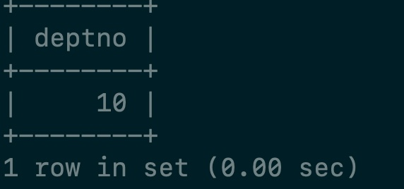

 1. 取得每个部门最高薪水的人员名称

    ```sql
    --  按照部门分组，找出每组的最大值
    select 
        deptno,max(sal) as maxsal
    from 
        emp
    group BY
        deptno;
    
    select 
        e.ename,t.*
    from 
        emp e
    JOIN
        (select deptno,max(sal) as maxsal from emp group BY deptno) t
    on 
        t.deptno = e.deptno and t.maxsal = e.sal;
    ```

    

 2. 哪些人的薪水在部门平均水平之上

    ```sql
    select ename,sal
    from emp a
    join (select avg(sal) as avgsal, deptno from emp group by deptno ) b
    on  a.sal > b.avgsal and a.deptno = b.deptno;
    ```

    

 3. 取得部门中(所有人的)平均的薪水等级

    ```sql
    
    select 
        e.deptno,avg(s.grade)
    from     
        emp e
    join 
        salgrade s
    on
        e.sal between s.losal and s.hisal
    group by
        e.deptno;
    ```

    

 4. 不准用组函数(Max)，取得最高薪水(给出两种解决方案)

    方法1:

    ```sql
    select 
        sal
    from 
        emp
    order by
        sal desc
    limit 
        0,1;
    ```

    方法2:表的自连接

    ```sql
    select sal from emp where sal not in(select distinct a.sal from emp a join emp b on a.sal < b.sal);
    ```

 5. 取得平均薪水最高的部门的部门编号(至少给出两种解决方案)

    方法1:求出所有的部门的平均薪水，然后降序取第一个。

    ```sql
    select deptno
    from (select deptno,avg(sal) as avgsal from emp group by deptno) t
    order by avgsal desc
    limit 1;
    ```

    方法2： 先找出最高是多少,然后等于

    ```sql
    select deptno
    from emp
    group by deptno
    having
    avg(sal) = (select max(avgsal) from (select avg(sal) as avgsal from emp group by deptno) t);
    ```

    

 6. 取得平均薪水最高的部门的部门名称

    ```sql
    select dname 
    from dept
    where deptno = (select deptno
    from emp
    group by deptno
    having
    avg(sal) = (select max(avgsal) from (select avg(sal) as avgsal from emp group by deptno) t));
    ```

    

 7. 求平均薪水的等级最低的部门的部门名称

    ```sql
    select dname 
    from dept
    where deptno = (select deptno
    from emp
    group by deptno
    having
    avg(sal) = (select min(avgsal) from (select avg(sal) as avgsal from emp group by deptno) t));
    ```

    

 8. 取得比普通员工（员工代码没有在mgr字段上出现的）最高薪水还要高的领导人姓名。

    先找出所有mgr不为空的empno

    ```sql
    select distinct mgr 
    from emp where mgr is not null;
    ```

    找出他们最高的薪水

    ```sql
    select max(sal) 
    from emp 
    where empno not in (select distinct mgr from emp where mgr is not null);
    ```

    然后找出领导人姓名

    ```sql
    select ename,sal 
    from emp 
    where sal > (select max(sal) from emp where empno not in (select distinct mgr from emp where mgr is not null));
    ```

    

 9. 取得薪水最高的前五名员工

    ```sql
    select 
        ename,sal 
    from 
        emp
    order by
        sal desc
    limit 
        5;
     
    ```

    

10. 取得薪水最高的第六到第十名员工

    ```sql
    select 
        ename,sal 
    from 
        emp
    order by
        sal desc
    limit 
        5,5;
    ```

    

11. 取得最后入职的5名员工

    ```sql
    select ename,hiredate
    from emp
    order by 
        hiredate desc
    limit 
        5;
    ```

    

12. 取得每个薪水等级有多少员工

    首先求出每个员工的工资等级

    ```sql
    select 
        e.ename,s.grade
    from
        emp e
    join 
        salgrade s
    on 
        e.sal between s.losal and hisal;
    ```

    

    然后把它视作一张表

    ```sql
    select
        grade,count(grade)
    from 
        (select e.ename,s.grade from emp e join salgrade s on e.sal between s.losal and hisal) t
    group by
        grade;
    ```

    

13. 面试.sql

    [建表的sql脚本](document/mianshi.sql)

    1. 找出没选过“黎明”老师的所有学生姓名。

       先找出上过黎明老师课的sname

       ```sql
       select 
           s.sname
       from 
           s
       join
           sc
       on
           s.sno = sc.sno
       join
           c
       on
           sc.cno = c.cno and c.cteacher = '黎明';
       ```

       然后not in

       ```sql
       select sname from s 
       where sname  not in (select 
           s.sname
       from 
           s
       join
           sc
       on
           s.sno = sc.sno
       join
           c
       on
           sc.cno = c.cno and c.cteacher = '黎明');
       ```

       

    2. 列出 2 门以上(含 2 门)不及格学生姓名及平均成绩。

       1. 先找出不及格的sno和出现次数

          ```sql
          select 
              count(sno),sno
          from
              sc
          where
              scgrade < 60
          group by
             sno;
          ```

          

          然后把它视作一张表 t,求出两门及以上不及格的学生sno

          ```sql
          select 
              t.sno,sum(scgrade) / 
          from 
              (select count(sno) as countsno,sno from sc where scgrade < 60 group by sno) t
          join
              sc
          on
              sc.sno = t.sno 
          where 
              countsno > 2;
          ```

    3. 即学过 1 号课程又学过 2 号课所有学生的姓名。

14. 列出所有员工及领导的姓名，没有上级的显示no，因为中文编码有误

    ```sql
    --如果b为空也要显示的话，把a视为主表，左连b
    ```

    ```sql
    select 
        a.ename,ifnull(b.ename,'no')
    from 
        emp a
    left join  
        emp b 
    on 
        a.mgr = b.empno;
    ```

    

15. 列出受雇日期早于其直接上级的所有员工的编号,姓名,部门名称

    ```sql
    select
        a.empno,a.ename,d.dname
    from
        emp a
    join
        emp b
    on
        a.hiredate < b.hiredate and a.mgr = b.empno
    join
        dept d
    on 
        a.deptno = d.deptno; 
    ```

    

16. 列出部门名称和这些部门的员工信息,同时列出那些没有员工的部门.

    以emp为主表

    ```sql
    select 
        dept.dname,emp.*
    from 
        emp
    right join
        dept
    on 
        emp.deptno = dept.deptno; 
    
    ```

17. 列出至少有 5 个员工的所有部门

    先找出每个部门的员工数，然后选出大于 5的，再与dept连接。

    ```sql
    select 
        e.deptno,d.dname
    from    
        emp e
    join
        dept d
    on
        e.deptno = d.deptno
    group by
        e.deptno
    having
        count(e.deptno) >= 5;
    
    ```

    

18. 列出薪金比"SMITH"多的所有员工信息.

    ```sql
    select * 
    from emp
    where sal > (select sal from emp where ename = 'smith');
    ```

19. 列出所有"CLERK"(办事员)的姓名及其部门名称,部门的人数.

    ```sql
    select
        e.ename,d.dname
    from
        emp e
    left join
        dept d
    on
        e.deptno = d.deptno
    
    where
        e.job = 'clerk';
    
    ```

20. 列出最低薪金大于 1500 的各种工作及从事此工作的全部雇员人数.