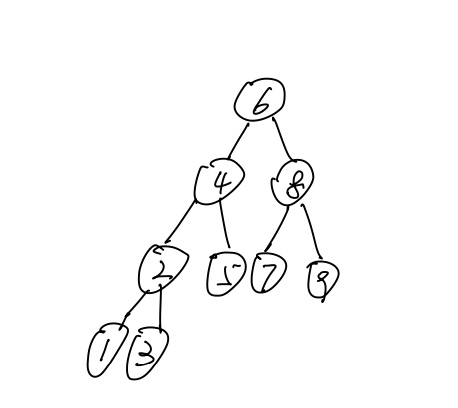
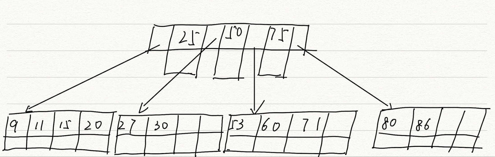
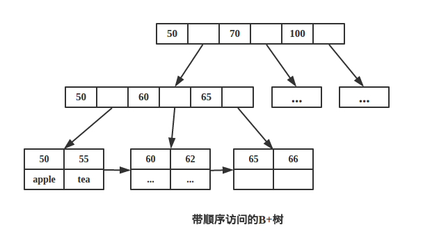
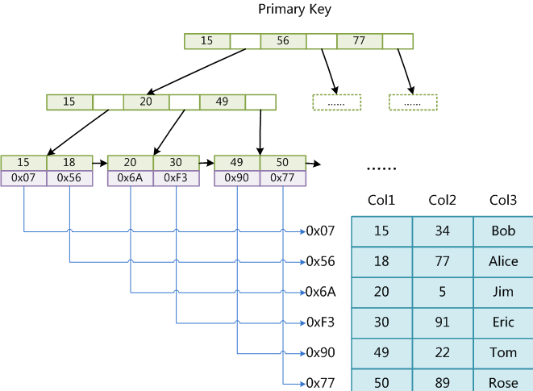
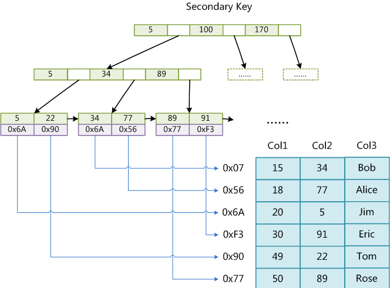

# MySQL索引的底层实现原理

目前大多数的数据库系统及文件系统都采用**B-Tree(B树)**或其变种**B+Tree(B+树)**作为索引结构。

在MySQL中，索引属于存储引擎中的概念。不同的存储引擎对索引的实现方式是不同的。

## B-Tree和B+Tree

注意是“B数”而不是”B减树“

### B-Tree

B代表balance，是平衡的意思。

传统的用来搜索的数据结构一般是平衡二叉树，例如AVL树和红黑树。

如图是一个平衡二叉搜索树（AVL）

它的缺点：

1. 平衡二叉树高度比较高，这样会导致逻辑上比较近的元素实际上比较远，例如图中根节点“6”距离“1”和“3”的距离是一样的。而机械硬盘中，探针每次都是读取一个区域的数据，当一个元素被访问，那么它附近的元素也会被访问，平衡二叉树不能利用这个特性。

2. 平衡二叉树的插入和删除元素都需要旋转来保持平衡。这需要对整棵树进行操作，如果平衡二叉树很大，一部分加载在内存一部分在硬盘中，那么旋转是十分困难的。

==B-Tree的设计就是迎合硬盘的读写==

每个数字下面的空格都会存储数据data。

如图就是B树的一个例子，它的每个节点都会存储数据。

- 在B树中，每个内部节点都会有不同个键，键将子树分开。

- 一般B树的高度在三层左右，层数越低，每个节点中的键越多，两个键确定的区间越精确。

- 节点的键可以为空，但是至少要一半。

> 对于二叉树，每向下一层只能分两个区间；而对于有三个键的B树，可以确定要查找的范围在哪个1/4区间中。

B-Tree的查找

- 由于key是有序的，所以我们在每个节点内用二分查找。

### B+Tree

B+树也是多路搜索树，它与B树的区别有二：

1. B+树的非叶子结点不存储真正的data，所有的关键字都存储在叶子结点中。

2. B+树所有的叶子结点都有链指针。

由于B+树的所有关键字都在叶子结点中，所以查询每个节点的时间复杂度都固定在 O(log n)。

B+树可以很好的利用局部性原理，若我们访问节点 key为 50，则 key 为 55、60、62 的节点将来也可能被访问。

> 由于B+树的叶子节点的数据都是使用链表连接起来的，而且他们在磁盘里是顺序存储的，所以当读到某个值的时候，磁盘预读原理就会提前把这些数据都读进内存，使得范围查询和排序都很快

综上所述，B+树更加适合外部存储。

MyISAM和InnoDB都是使用B+树作为索引结构

## MyISAM索引的实现

MyISAM 引擎使用 B+Tree 作为索引结构,叶节点的 data 域存放的是数据记录的地址。

### 主索引

这里的表共有三列，Col1为PK，图表示了一个MyISAM表的主索引。

==MyISAM的索引文件仅仅保存数据记录的地址。主索引不能重复。==

### 辅助索引

如图是在Col2列上建立的一个辅助索引，辅助索引的key可以

## InnoDB索引的实现